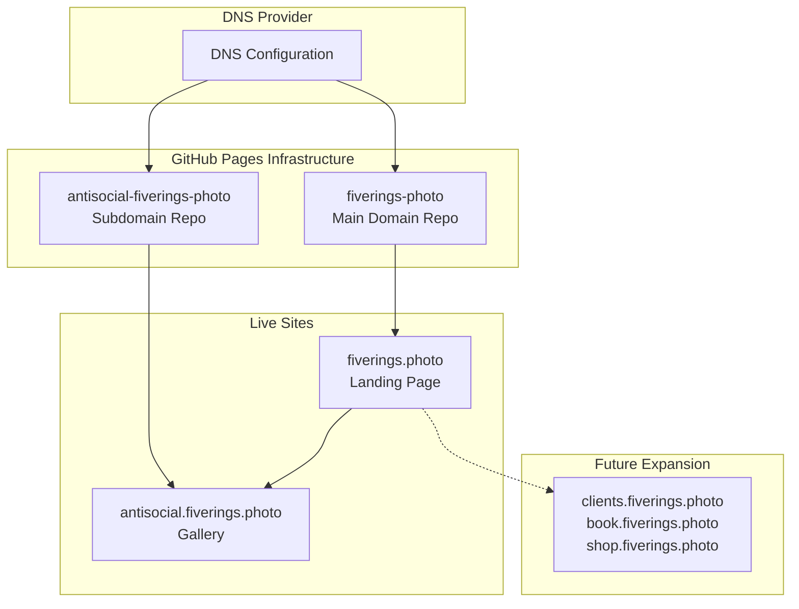

# Five Rings Photography - Technical Infrastructure

**Last Updated**: 2025-08-16  
**Status**: Production - Fully Operational  
**Domains**: fiverings.photo, antisocial.fiverings.photo  

## 🏗️ Current Production Architecture

### Domain Structure
- **fiverings.photo**: Professional gateway and service hub
  - Strategic landing page
  - Links to all photography services
  - Future service expansion ready
- **antisocial.fiverings.photo**: Gallery exhibition space
  - Hugo static site
  - Flynn theme (Tron aesthetic) locked
  - Active photography exhibition

### SSL/TLS Configuration
- **Provider**: Let's Encrypt via GitHub Pages
- **Status**: Both domains have valid SSL certificates
- **Auto-renewal**: Managed by GitHub Pages
- **Provisioning Time**: 5-15 minutes after domain configuration

## ⚠️ Critical GitHub Pages Configuration Note

When using **GitHub Actions workflow deployment**:
- The CNAME file in your deployment artifact does NOT automatically configure the custom domain
- You MUST manually set the custom domain via:
  1. **GitHub API** (recommended):
     ```bash
     gh api --method PUT repos/jur1st/fiverings-photo/pages \
       --field cname="fiverings.photo"
     ```
  2. **GitHub UI**: Settings → Pages → Custom domain field

This is different from branch deployment where CNAME files are auto-detected.

## 🗺️ Repository Architecture



## 📦 Repository Details

### 1. fiverings-photo (Main Domain)
- **GitHub**: https://github.com/jur1st/fiverings-photo
- **Local**: /Users/john/fiverings-photo/
- **Technology**: Static HTML (future React/Next.js ready)
- **Deployment**: GitHub Actions → public/ directory
- **Purpose**: Professional services gateway

### 2. antisocial-fiverings-photo (Gallery)
- **GitHub**: https://github.com/jur1st/antisocial-fiverings-photo
- **Local**: /Users/john/antisocial-fiverings-photo-WORKING/
- **Technology**: Hugo static site generator
- **Deployment**: GitHub Actions → Hugo build
- **Purpose**: Photography exhibition space

## 🚀 Deployment Pipeline

### Main Domain (fiverings-photo)
1. Push to main branch
2. GitHub Actions triggered (.github/workflows/deploy.yaml)
3. Deploy static files from /public
4. GitHub Pages serves at fiverings.photo

### Subdomain (antisocial-fiverings-photo)
1. Push to main branch
2. GitHub Actions triggered (.github/workflows/hugo.yml)
3. Hugo builds site
4. Deploy to GitHub Pages
5. Serve at antisocial.fiverings.photo

## 🔍 Verification Commands

### DNS Verification
```bash
# Check A records for main domain
dig fiverings.photo

# Check CNAME for subdomain
dig antisocial.fiverings.photo

# Verify both domains resolve
nslookup fiverings.photo
nslookup antisocial.fiverings.photo
```

### SSL Certificate Check
```bash
# Test HTTPS on main domain
curl -I https://fiverings.photo

# Test HTTPS on subdomain
curl -I https://antisocial.fiverings.photo

# Check certificate details
openssl s_client -connect fiverings.photo:443 -servername fiverings.photo
```

### GitHub Pages Status
```bash
# Check Pages configuration
gh api repos/jur1st/fiverings-photo/pages

# Check latest deployment
gh api repos/jur1st/fiverings-photo/actions/runs --jq '.workflow_runs[0]'
```

## 🔧 Troubleshooting

### SSL Certificate Not Working
1. Verify DNS A records point to GitHub Pages IPs
2. Check custom domain is set in GitHub Pages settings
3. If using workflow deployment, use API to set custom domain
4. Wait 10-30 minutes for provisioning
5. Clear browser cache and retry

### Custom Domain Not Recognized
```bash
# Set via API (workflow deployment)
gh api --method PUT repos/jur1st/fiverings-photo/pages \
  --field cname="your-domain.com"

# Trigger rebuild
git commit --allow-empty -m "Trigger rebuild" && git push
```

### 404 Errors on Custom Domain
- Ensure CNAME file exists in deployment directory
- Verify GitHub Pages is enabled
- Check workflow completed successfully
- Allow time for DNS propagation

## 🎯 Future Expansion Architecture

### Planned Subdomains
- **clients.fiverings.photo**: Client gallery portal
- **book.fiverings.photo**: Booking and scheduling system
- **shop.fiverings.photo**: Print sales and merchandise

### Technology Considerations
- Main domain ready for React/Next.js upgrade
- Subdomains can be independent repos
- Shared authentication possible via GitHub OAuth
- CDN integration via Cloudflare (future)

## 📚 Related Documentation

- [DNS Configuration](docs/DNS-CONFIGURATION.md) - Detailed DNS setup
- [GitHub Pages Setup](docs/GITHUB-PAGES.md) - Pages configuration guide
- [SSL Certificates](docs/SSL-CERTIFICATES.md) - Certificate management
- [Deployment Guide](docs/DEPLOYMENT.md) - CI/CD workflow details

---

**Infrastructure Status**: ✅ Operational  
**SSL Status**: ✅ Both domains secured  
**Next Steps**: Build features, not fix infrastructure!